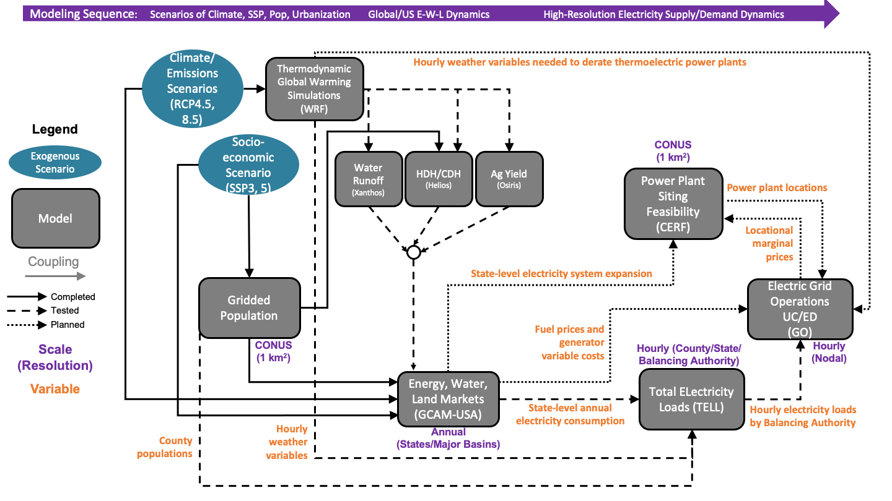

# IM3 Experiment Diagrams

Diagrams representing each experiment in the IM3 project.

To update a diagram:
* If you feel uncomfortable interacting with git, [open an issue](https://github.com/IMMM-SFA/im3components/issues) and a DSC team member will help you through the process.
* Otherwise:
    * Create a new branch from `develop`.
    * Make your updates in that branch.
    * Include an updated static image (or a DSC team member can add it to your pull request).
    * Open a pull request with your updated files.

## Current Diagrams

### Experiment A N1 CONUS

  

### Experiment A N2 Urban

  

### Experiment A N3 Interconnect

  

### Experiment C N4 CONUS

  

### Experiment C N5 Subdomain

  

### Experiment B N6 Interconnect

  

### Experiment D N7 CONUS

  

### Experiment D N8 Subdomain

  

